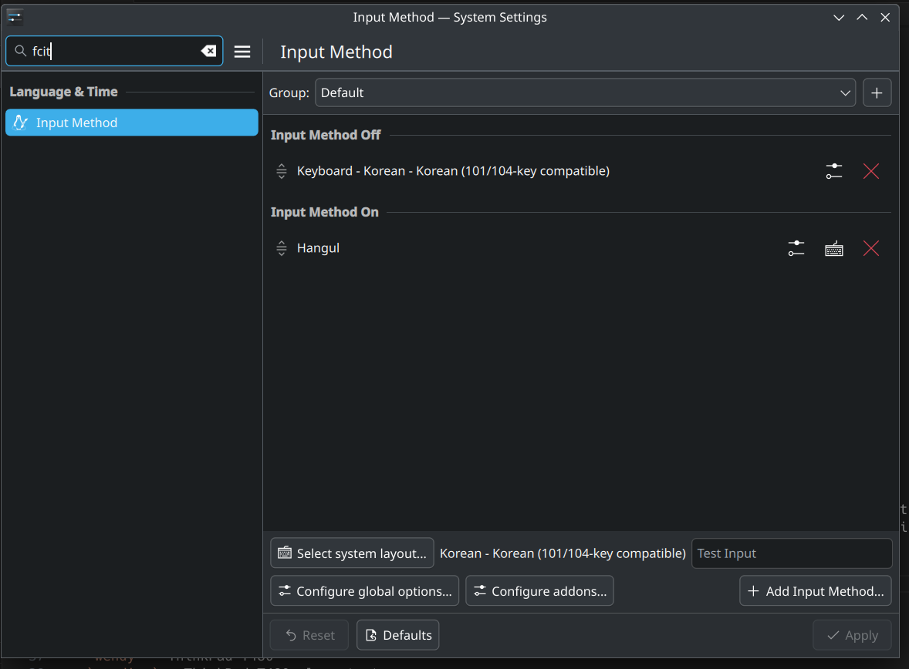

# NixOS-config

Holds my configuration files for my NixOS machines


# Installation

If installing on a new machine or restoring:

```
# If on a new system, git will not be available
# Use legacy nix shell as nix flakes is not yet enabled
nix-shell -p git

# If using my dotfiles, run:
git clone git@github.com:ericswpark/dot_files.git ~/.dotfiles

git clone git@github.com:ericswpark/nixos-config.git ~/nixos-config
sudo mv /etc/nixos /etc/nixos.bak
sudo ln -s ~/nixos-config/ /etc/nixos

# New machines have wrong hostname set, set manually
sudo nixos-rebuild switch --flake ~/nixos-config/#hostnamehere
```

## Post-installation steps

- Adjust any hardware-specific settings
- Generate SSH keys, add to GitHub
- Import GPG keys
- Consider setting up Korean input ([see below](#korean-input))
- Setup Tailscale

# Updates

```
nix flake update
sudo nixos-rebuild switch
```

# Setup

## Korean input

A few more setup steps are required for Korean input after installation:

- Under "System Settings > Keyboard > Virtual Keyboard", select "Fcitx 5 Wayland Launcher (Experimental)" and click "Apply"
- Under "System Settings > Language & Time > Input Method", add the "Hangul" input method and ensure it is under "Input Method On". Also add the "Keyboard - Korean - Korean (101/104-key compatible)" layout if you want English input (under the Korean keyboard layout). At the end it should look like this:



- Remove the "Left Shift" key from "Temporarily switch between first and current Input Method" under "Global Options". Otherwise the input method will switch each time you press Shift and it becomes incredibly annoying. (Why is this even the default?!)
- Click "Apply" for all levels to save changes and reboot (or log out and log back in)

If Korean input is _still_ not working, then you may need to force it to run under KWin. To do this, quit all `fcitx5` instances (right click on the tray icon and select Quit), then click on the Virtual Keyboard icon to enable the "On-Screen Keyboard". This will force KWin to launch `fcitx5`, and now your Korean input should work! (Note that despite the name "On-Screen Keyboard" it will not show a on-screen keyboard.)

## OneDrive mount

Used for Purdue

- `rclone config`
- `n` (new config)
- `onedrive` (storage type)
- Press Enter twice to leave `client_id` and `client_secret` empty
- `global` (region)
- Press Enter to leave `tenant` empty
- `n` for advanced config
- `y` to authenticate with browser
- Sign in with credentials
- `onedrive` for `config_type`
- `1` for `config_driveid` (there should only be one)
- `y` to confirm drive
- `y` to confirm remote
- `q` to quit
- `systemctl --user enable --now rclone-purdue-mount`


# Hosts

- `wendy` - ThinkPad T480
- `wendigo` - ThinkPad T480 clone test
